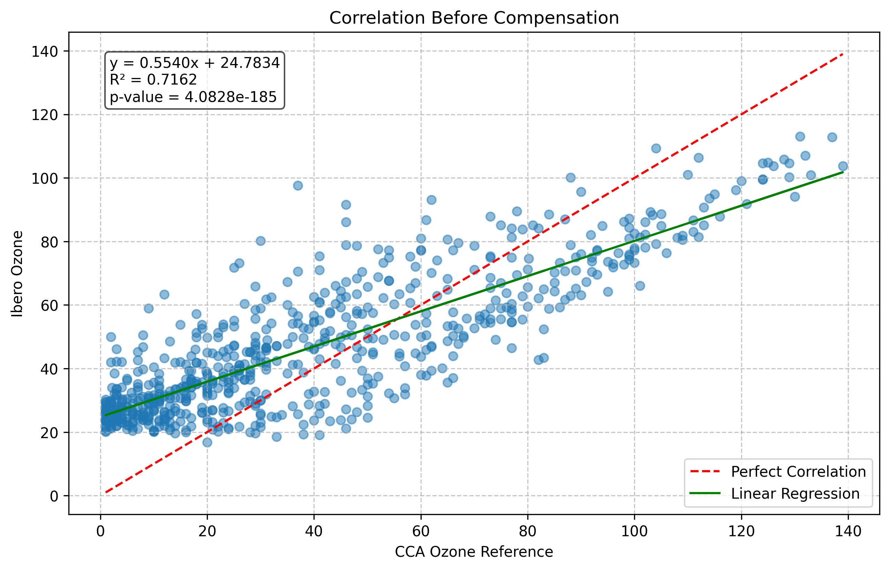
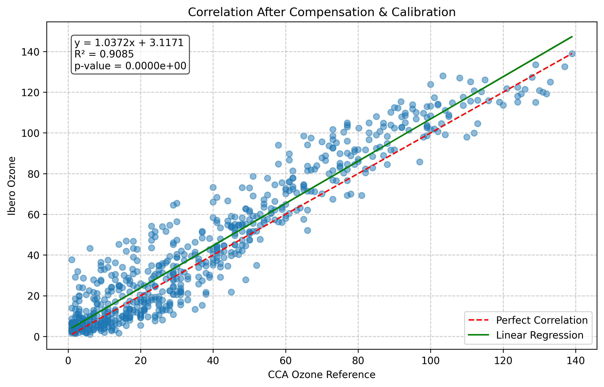

# SMAAcomp – Baseline Calibration Workflow for Low-Cost Air Quality Sensors

This repository contains the baseline Python workflow developed for the compensation and two-point calibration of low-cost air quality sensors using reference station data from Mexico City. The workflow provides a reproducible foundation for future implementation of machine learning calibration models (e.g., Random Forest, SVR), aligning with open-science practices and reproducibility standards.

## Overview

The script performs temperature and humidity compensation and a two-point calibration of ozone (O₃) and carbon monoxide (CO) sensor data using datasets from multiple monitoring stations (IBERO2, UNAM, and CCA). It generates statistical metrics and correlation plots to evaluate sensor performance before and after compensation under real atmospheric conditions.

## Repository Structure

SMAACOMP-MAIN/  
├── 2023-03-unam_hora_L1.csv  
├── cca_o3_co_2023-04-11.csv  
├── ibero2_0703_0403.csv  
├── claudeSma.py  
├── correlation_before_compensation.png  
├── correlation_after_compensation.png  
└── README.md  

## Datasets Used

### Dataset: 2023-03-unam_hora_L1.csv

This dataset contains hourly meteorological measurements from the UNAM reference station, used to support the compensation and calibration of low-cost air quality sensors.  
It includes environmental parameters that influence sensor performance, such as temperature, humidity, and pressure.

| Column Name | Description | Unit / Type | Example Value |
|--------------|--------------|--------------|----------------|
| `TIMESTAMP` | Date and hour of the measurement (local time) | Datetime | 07/03/23 16:00 |
| `Temp_Avg` | Average ambient temperature | °C | 26.99 |
| `RH_Avg` | Average relative humidity | % | 4.38 |
| `WSpeed_Avg` | Average wind speed | m/s | 2.665 |
| `WSpeed_Max` | Maximum wind speed recorded during the hour | m/s | 7.35 |
| `WDir_Avg` | Average wind direction | ° (0–360) | 318.6 |
| `Rain_Tot` | Total rainfall per hour | mm | 0 |
| `Press_Avg` | Average barometric pressure | hPa | 775.209 |
| `Rad_Avg` | Average solar radiation | W/m² | 708.897 |

**Total rows:** ~700 (hourly records)  
**Period covered:** March 2023  
**Usage:** Reference dataset for environmental compensation in model calibration.

### Dataset: cca_o3_co_2023-04-11.csv

This dataset contains hourly measurements from the **CCA reference station**, used for sensor calibration and validation.  
It includes reference values for carbon monoxide (CO), ozone (O₃), and particulate matter (PM₂.₅) — the key pollutants used to assess the accuracy of low-cost air quality sensors.

| Column Name | Description | Unit / Type | Example Value |
|--------------|--------------|--------------|----------------|
| `Fecha` | Date of measurement | Date | 07/03/23 |
| `Hora` | Hour of measurement (24h format) | Integer | 16 |
| `ccaco` | Carbon monoxide concentration | ppm | 0.45 |
| `ccao3` | Ozone concentration | ppb | 83 |
| `ccapm2` | PM₂.₅ concentration | µg/m³ | 3 |

**Total rows:** ~700 (hourly records)  
**Period covered:** March 2023  
**Usage:** Serves as the **main reference dataset** for calibration and comparison against low-cost sensor data.

### Dataset: ibero2_0703_0403.csv

This dataset contains raw data collected by the **IBERO low-cost air quality sensor**, located at Universidad Iberoamericana (Mexico City).  
The dataset includes concentrations of particulate matter (PM₂.₅ and PM₁₀), ozone, and carbon monoxide, along with environmental variables such as temperature and humidity.  
It is used as the **main experimental dataset** to test calibration routines and compare against reference stations.

| Column Name | Description | Unit / Type | Example Value |
|--------------|--------------|--------------|----------------|
| `Timestamp` | Local date and time of measurement | Datetime | 07/03/23 11:26 |
| `PM2.5_Data` | Measured PM₂.₅ concentration | µg/m³ | 20 |
| `PM10*_Data` | Measured PM₁₀ concentration | µg/m³ | 21 |
| `Ozone_Data` | Ozone sensor output | ppb | 27 |
| `Carbon_Monoxide_Data` | CO sensor output | ppm (raw value) | 862 |
| `Temperature_Data` | Internal temperature at the sensor | °C | 16.27 |
| `Relative_Humidity_Data` | Relative humidity at the sensor | % | 23.03 |

**Total rows:** ~1,000 (5-minute intervals)  
**Period covered:** March–April 2023  
**Usage:** Core dataset for calibration and validation of low-cost air quality sensors against reference data.


## How to Run

1. Install dependencies:
   ```bash
   pip install pandas numpy matplotlib scipy

2. Run the workflow:
    ```bash
    python claudeSma.py

3. Output:

- **Correlation plots before and after compensation.**

- **Calibration statistics (R², RMSE, p-value).**

- **Console summary of model performance.**

## Example Results

**Before Compensation**  


**After Compensation**  


After applying the compensation and two-point calibration, the correlation between the low-cost sensor and the reference station improved markedly (e.g., from R² ≈ 0.71 to R² ≈ 0.91), indicating a substantial gain in data reliability for downstream analyses.

## Context and Next Steps

This baseline workflow establishes a reproducible pipeline for temperature/humidity compensation and calibration of low-cost air quality sensors using reference data. The next phase will add machine learning models (e.g., Random Forest, SVR, Gradient Boosting) to enable adaptive, site-transferable calibration. Planned outputs include model scripts, trained artifacts, evaluation notebooks, and guidance for deployment on new sensors and locations.

## Citation

If you use this workflow, dataset, or its results, please cite:

Horacio Serafín Jiménez Soto, Octavio Serafín Jiménez Soto, & D. A. Pérez-De La Mora (2025).  
*SMAAcomp: Baseline Calibration Workflow for Low-Cost Air Quality Sensors.*  
Zenodo. DOI: 10.5281/zenodo.17517011

## License

This project is distributed under the **MIT License**.  
You are free to use, modify, and redistribute this code, provided that proper credit is given to the authors.

## Authors

- **Horacio Serafín Jiménez Soto** — Smability  
- **Octavio Serafín Jiménez Soto** — Smability  
- **D. A. Pérez-De La Mora** — Instituto de Investigación Aplicada y Tecnología (INIAT), Universidad Iberoamericana, Ciudad de México

```markdown
---

*Maintained by Smability and INIAT (Universidad Iberoamericana).  
For inquiries or collaborations, please contact:*  
info@smability.io | daniel.perez@ibero.mx
